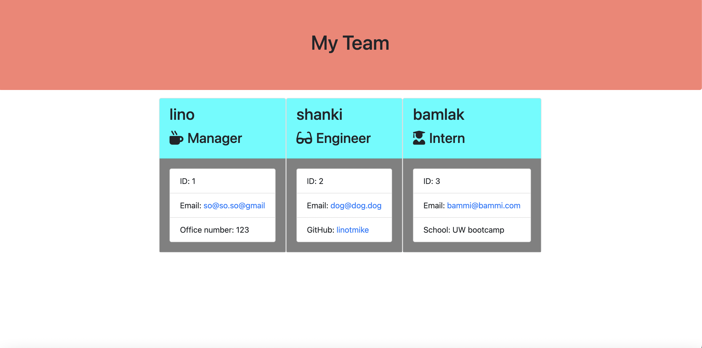

# profile-Generator

## Description
This command line application is called team profile generator. It asks a simple questions answered from terminal. I used HTML, JavaScript, node.js and applied styling to the css by using inline inside the html element. Node.js provided the primary functionality for this application.
    
## Screenshot

## Table of Contents
* [Installation](#installation)
* [Usage](#usage)
* [License](#license)
* [Contributors](#contributors)
* [Tests](#tests)
* [Questions](#questions)
    
## Installation
To install this profile generator you will need to install node.js after that install the npm by using 'npm i' and that will install the node-modules.

## Usuage
After following the installation process it is very simple toto use this profile generator, from the terminal run 'node index.js' and simply answer the questions to generate the profile generator and it will output it in a dist folder and will generate an index.html.

## License
MIT

## Contributions
Birhanu Mengistu

## Tests
N/A

## Questions

How to reach me:

Github : https://github.com/linotmike

Email : linotmike.mk@gmail.com

## Links

Github repo: https://github.com/linotmike/profile-Generator

    
